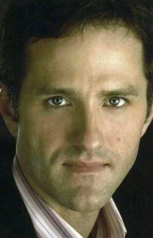
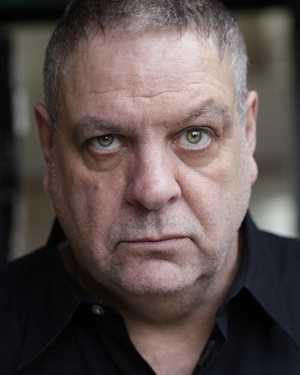
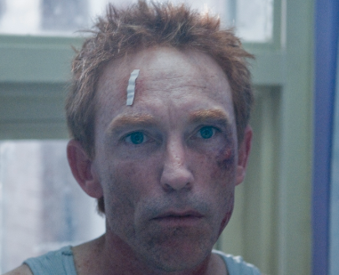
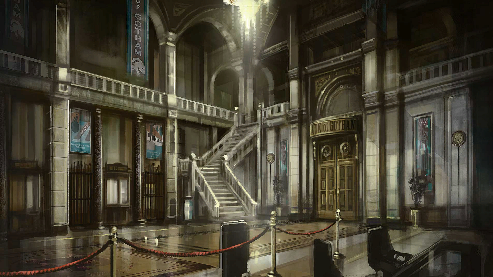
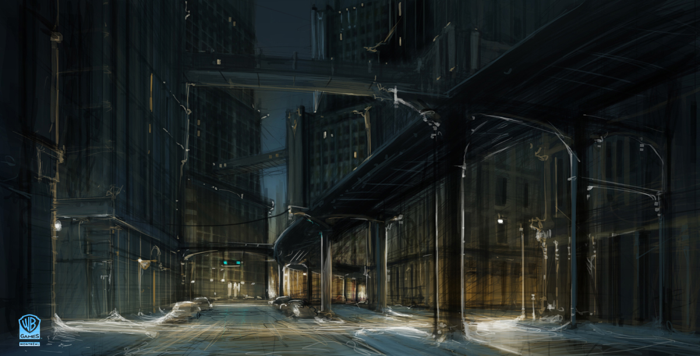

Où nos héros sont réveillés au milieu de la nuit pour enqueter sur une évasion
à la prison de Bedlam, qui finit par un combat au sommet d'un gratte-ciel sous
les éclairs.

Le téléphone d'Ellie Donova, Jim Petriusky et Ed Shelby sonne à peu près au même
moment au milieu de la nuit. Westmore, leur boss, les appelle en urgence au
pénitencier pour une grave affaire.

  

  

  

Arrivés là, ils apprennent que John Cassidy, un dangereux tueurs (12 personnes
à son actif), s'est échappé de sa cellule de haute sécurité. Il aurait
apparemment brisé le mur de sortie, au 2e étage, au dessus de la mer agitée.

En étudiant les bandes vidéos, ils trouvent que son dernier entretient était
avec son avocat, un dénommé Mercer, qu'il rencontre toutes les deux semaines.
Après cet entretien, Cassidy était très énervé et semble avoir arraché la video
de surveillance du mur.

Les gardes-cote trouvent un zodiac a la dérive, avec un jeune mexicain au bras
arraché à son bord. Il semble terrorisé par la vision "d'El Diablo", et la photo
de Cassidy semble raviver ses peurs. Ellie le ramène à l'hopital le plus
proche.

Ed et Jim discutent avec Sara Mayfield, la psychologue de Cassidy qui fait son
sujet de thèse sur lui mais semble avoir le béguin pour lui. Ils ont peu de
temps pour continuer leur recherches avant que la radio ne prévienne d'une prise
d'otages au tribunal.

Le groupe se retrouve là bas, et après étude rapide des plans décide de rentrer
par les escaliers de service, en passant par la caféteria. Ils arrivent
discretement jusqu'à la salle du tribunal devant laquelle deux agents de
securité du tribunal montent la garde. Une femme de ménage semble déjà touchée
et perds du sang.

Jim tente de se faufiler discretement près du garde mais celui-ci l'aperçois.
Ed réagit au quart de tour et parvient à l'abattre alors que le second court
vers le groupe, la balle suivant assome Jim qui se cogne contre le mur, puis
Ellie glisse vers l'arme du premier garde, la ramasse et dans le même mouvement
lui perfore la poitrine. Alors que le calme revient, un avocat vient vers eux en
titubant, semblant en panique. Sans que personne ne puisse réagir, il plante un
stylo plume dans le coup d'Ellie, alors que ses yeux et sa bouche semble dire
"Aidez-moi". La blessure est profonde mais Ed assomme rapidement l'avocat.

Un bruit de verre brisé dans la salle du tribunal, et notre équipe rentre.
Dedans, tout le mobilier est brisé, les fenetres sont en miettes et les rideaux
lacérés, flottent au grè de la tempête. Dans l'éclat d'un éclair, ils ont le
temps de voir une silhouette musculeuse, aux ailes de chauve souris, sauter par
la fenetre. Ed tente de tirer dessus mais le rate pendant que Jim va porter
secours à l'homme effondré sur le sol, les vetements en lambeaux.

Il s'agit de Mercer, l'avocat. Cassidy est venu vers lui lui demander le nom et
l'adresse de son employeur. Il donne la même réponse aux joueurs: une dénommé
Veronica Pearl, ainsi que son adresse. Nos héros remontent dans la voiture d'Ed
et foncent vers le gratte-ciel de Pearl.

Sur le chemin, ils voient la silhouette ailée planer au dessus des voitures,
créant des accidents qu'ils doivent éviter. Finalement, ils parviennent au pied
de l'immeuble au moment ou la créature s'envole vers le haut. Durant le voyage,
Jim parvient à obtenir plus d'infos sur Pearl, avant que son ordi ne le lache.
Dans l'ascenseur, il parvient à faire le lien final: Veronica Pearl n'est autre
que Sara Mayfield!

Son appartement est en parti détruit; plus de lumière, les vitres qui donnent
sur l'exterieur sont détruites. Sara est cachée derrière son bureau, elle
indique à Ellie où trouver les seringues pour guérir Cassidy. Ellie ne croit pas
à son bluff et décèle que la rouge va le tuer alors que la verte va le guérir.
Ils tentent tous de négocier avec Cassidy, pour lui faire lacher prise de la
gorge de Sara qu'il tient au dessus du vide.

Finalement, Cassidy jette Sara, qui manque de chuter du haut du 52e étage mais
est rattrapée de justesse. Juste avant que Cassidy ne s'envole, Ed lui injecte
la seringue verte, et il reprends petit à petit l'apparence humaine du pauvre
Cassidy et non celle du monstre. Dans ses yeux se lit la peine d'etre redevenu
le petit Cassidy. Il fait quelques pas en arrière pour chuter, Ed hésite à la
rattraper, puis se ravise, et Ellie le voit chuter de l'autre bout de la pièce,
l'incompréhension sur son visage.

Peu de temps après, la police et le reste du FBI entre dans l'appartement. Nos
trois agents sont escortés en dehors du batiment par d'autres agents aux
lunettes noires (Jim parvient à uploader toute les videos de la nuit sur son
serveur privé).

Ils sont emmenés dans une base secrète du FBI où on leur apprends que Veronica
fait parti d'un groupe de scientifiques qui font des experiences pour créer des
surhommes pour l'armée. Cassidy est l'une de ces experiences, mais elle semble
avoir mal tourné, transformant le pauvre Cassidy en une bete sanguinaire dès
qu'il tente de mettre fin à ses jours. Victoria a payé Mercer pour faire durer
le procès pour qu'elle puisse, sous les traits de Sara, l'étudier le plus
longtemps possible.

Cassidy en ayant assez de cet enfermement a finalement brisé ses chaines et est
allé interroger Mercer pour avoir le nom et l'adresse de la personne derrière
tout ça, là où les PJs ont pu l'arreter, et en annulant la transformation d'El
Diablo, temporairement lui permettre de se suicider.

Ce premier chapitre se termine quand Pearl annonce à nos agents que d'autres
experiences comme Cassidy sont dans la nature, et qu'elle a trois places pour
former une unité spéciale chargée de les surveiller et les appréhender.

To be continued...
