Lors de la deuxième session, les joueurs ont commencé dans la chapelle de Sœur Daphné, là où ils avaient réussi à aller à la fin de la première session, où ils ont rencontré les différentes personnes qui vivent dans la chapelle.

### Discussion avec les survivants de la chapelle

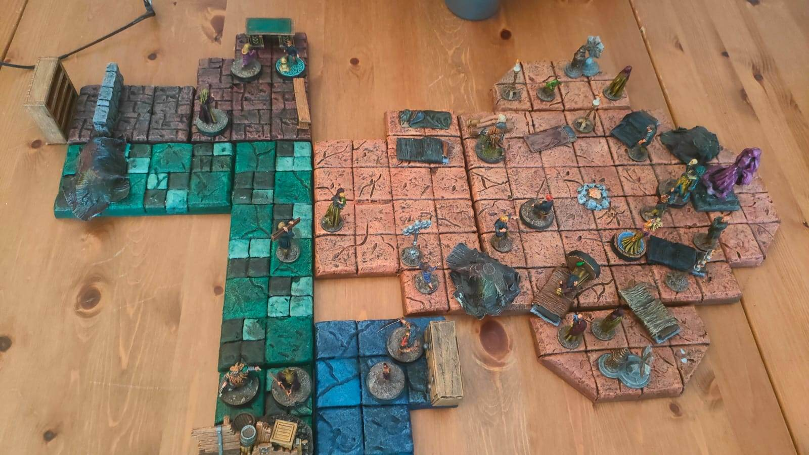

Un dénommé Loïk, qui semble avoir des hallucinations auditives, et qui croit constamment qu'on l'appelle et qui se frappe le crâne pour en chasser les voix. Son accent, ses manières et les traits de son visage semblent rappeller quelque chose à <i>Cornes</i>, qui s'avère elle aussi venir de territoires enneigés. Tut m'avait demandé de tirer aléatoirement aux dés son Terrain Favori et Ennemi Juré de rôdeur, puisque son perso ne se souvient de rien. Et il s'avère que les terres enneigées sont son Terrain Favori.

<i>Cornes</i> essaie de calmer Loïk, en lui faisant une petite danse de leur région d'origine, mais cela ne fait que l'exciter encore plus et il bouge tellement que l'infirmière qui essaie de lui faire une piqûre n'y parvient pas. La dose est gâchée, et Loïk restera excité pour la soirée.

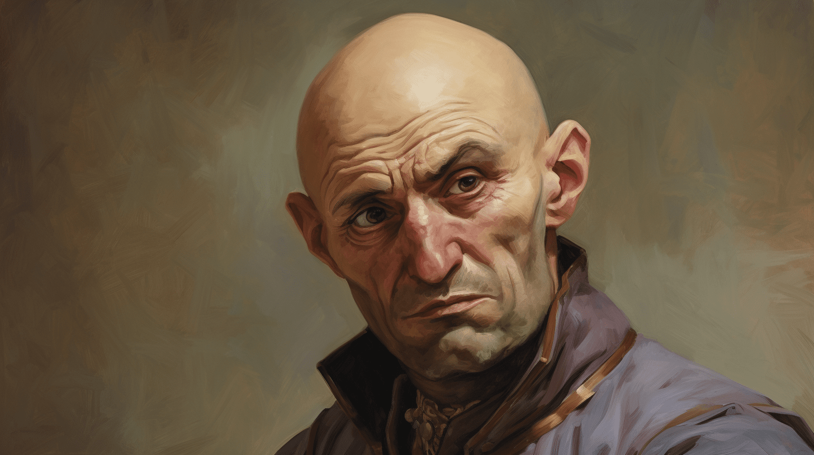

Ils ont aussi besoin de bois, à la fois pour reconstruire la barricade au Nord (qui se fait abimer à chaque attaque de Changeforme), mais aussi pour faire un feu dans la chapelle. <i>La p'tite</i> utilise une énorme masse d'armes qu'elle a trouvé pour briser un meuble en deux et ainsi faire pas mal de bois. Cela impressionne beaucoup Lucellin, un brancardier reconverti en garde de la chapelle.

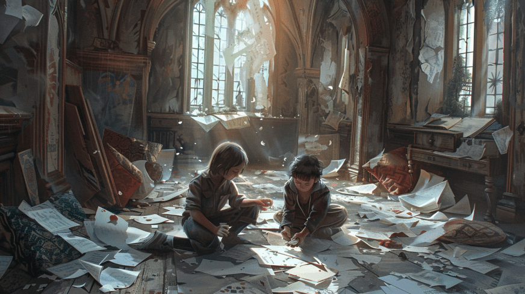

Les PJs discutent aussi longuement avec "Nana". "Nana" s'occupe de Braem et Maeva, deux petits enfants qui jouent avec les anciens livres du prêtre, se faisant une cachette sous son bureau, et des origamis avec les feuilles des livres.

"Nana" est une ancienne infirmière et leur indique qu'ils ont très peu de médicaments et que ça serait bien, si jamais ils arrivent à en trouver d'autres, de pouvoir les ramener. Au point où ils en sont, ils peuvent faire des mélanges de médicaments, utilisant un type de médicament pour un autre. Au point où ils en sont, tout est bon à prendre.

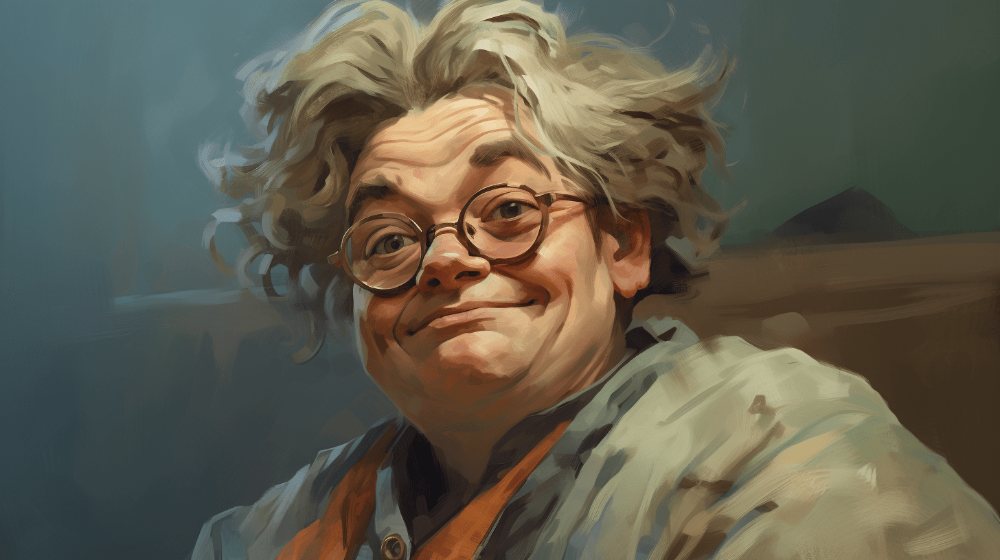

<i>Scalpel</i> (qui se fait appeller <i>Random</i>) aide Darren, le cuisinier gnome, à préparer à manger. Darren est plein de tics, mais très habile avec un couteau. Ensemble, ils préparent une bonne ration de patates et de carottes pour le repas du soir.

Après avoir discuté avec les survivants de la chapelle, les joueurs sont rapidement acceptés au sein de la communauté. Ils décident de retourner tout au bout du couloir récupérer un petit peu de mobilier, dans les pièces qu'ils avaient visitées. Ils remarquent que plusieurs des cadavres qui étaient restés sur les tables au bout du couloir ont disparu et ont vraisemblablement été tirés par le passage rempli d'éboulis au bout à gauche du couloir, celui qu'ils n'ont pas exploré.

### Qui sont les PJs et où sont-ils ?

Sœur Daphné leur explique que l'asile de Rochépine est situé sur une île au milieu d'un lac. L'asile n'est pas le plus réputé, mais ce n'est pas le pire non plus. Il semble que les médecins aient vraiment envie de comprendre les pathologies du cerveau. La directrice, Élise Losandro, cherche particulièrement à comprendre comment le cerveau fonctionne et elle semble avoir des méthodes de travail particulièrement réputées.

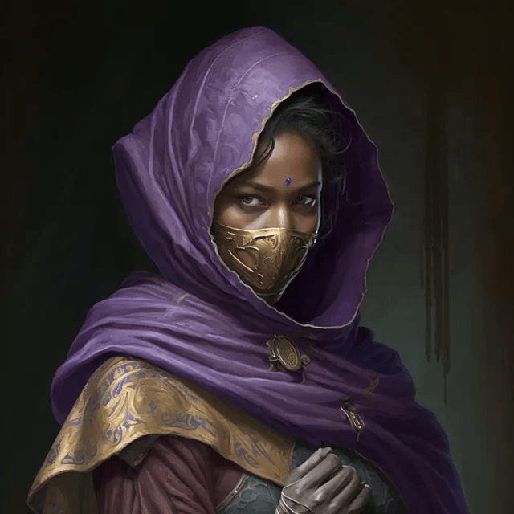

Sœur Daphné semble avoir au mauvais endroit au mauvais moment. Son ami Aymeric, un Pistolier Royal, enquête sur la disparition de Wolfgang Von Friedrich, le comte de la région. Von Friedrich a disparu et ne donne plus de signes de vie. Il venait régulièrement à Rochépine avant sa disparition, et Aymeric a demandé à Sœur Daphné d'enquêter sur Rochéphine et voir si elle trouvait une piste. 

En discutant avec d'autres infirmières, les PJs apprennent qu'ils étaient des patients ici, qu'ils ont été admis tous ensemble pour un cas d'amnésie collective et qu'ils ne sont pas passés par les protocoles normaux, mais sont entrés directement auprès de la directrice Losandro. 

### Le mur jaune

Sœur Daphné leur indique qu'ils sont enfermés ici, que le seul moyen de sortir est par ce qui était anciennement une porte qui donne dans le hall d'entrée principal. Mais sur la porte, des champignons jaunes ont poussé et semblent avoir donné vie à une étrange créature faire de moisissure. On peut entendre la créature pleurer parfois. Quand les PJs s'en approchent, ils entendent effectivement les champignons pleurer. Au centre de la moisissure se trouve un œil qui s'ouvre au milieu, un œil avec plein de pupilles impétrées les unes dans les autres et une mâchoire de dents en plein centre qui n'arrête pas de crier avec trois voix superposées « Qui suis-je devenu ? »

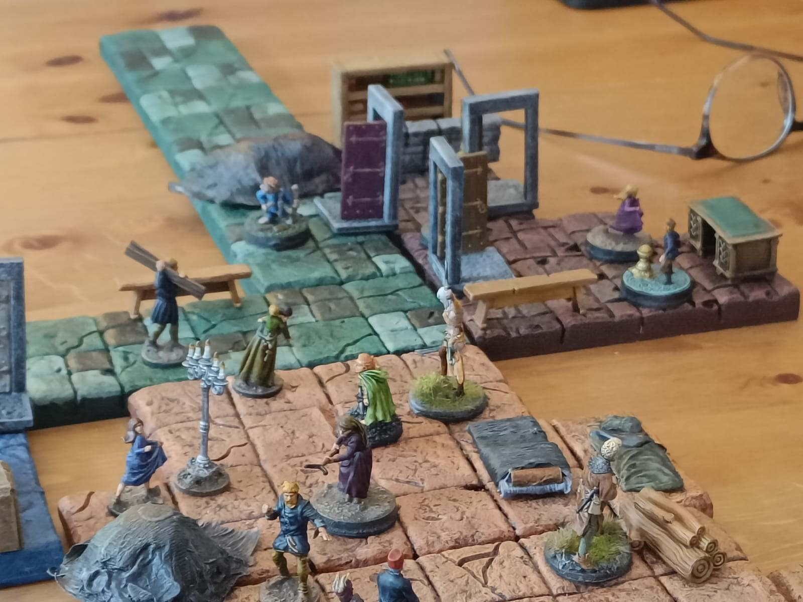

Ils essaient de lui donner un carnet d'un patient qu'ils ont trouvé dans la chambre du prêtre. Ils essaie de discuter avec le mur, mais tout cela sans succès, et ils finissent par engager un combat avec. Le mur rempli de moisissures semble avancer, la couche de moisissures englobe les personnages, <i>Scalpel</i> arrive à s'enfuir en arrière sans se faire attraper, mais les deux autres sont englobés à l'intérieur, subissent énormément de dégâts d'acide. On ne voit plus que leur forme à l'intérieur de la membrane, cherchant à sortir. À force de coups répétés, ils parviennent à sortir, brisant la membrane de la moisissure et répandant un torrent d'ammoniaque dans le couloir.

### Le Hall d'entrée

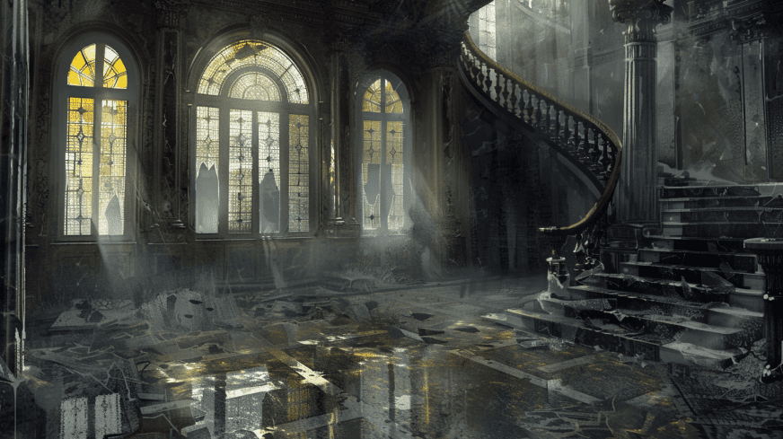

Arrivés de l'autre côté, ils arrivent dans le hall d'entrée principale de l'asile. Une double porte donne vers l'extérieur, les PJs essaient de l'ouvrir, bien que le bois ai un peu gonflé et semble s'être incrusté dans le mur autour. Ils parviennent à l'ouvrir et dehors, distinguent au travers du brouillard une foret au loin, avec de grands arbres tels des sapins. Mais les arbres se mettent à bouger, et ce qu'ils avaient pris pour des arbres sont en fait les pattes d'une immense araignée. Ils rentrent vite à l'intérieur et barricadent la porte d'entrée avec le mobilier qu'ils trouvent.

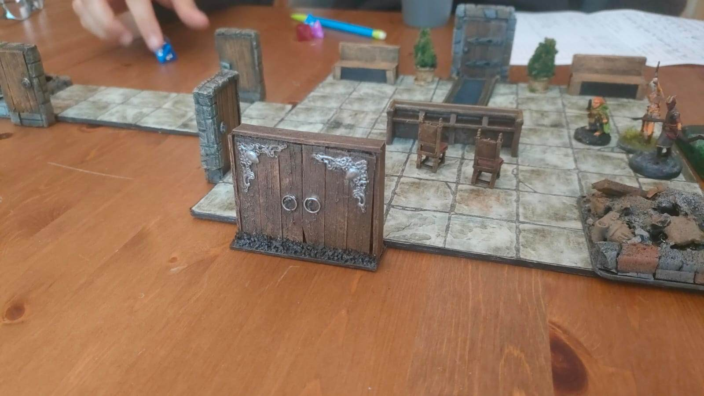

Explorant les différentes portes adjacentes à cette grande salle, ils découvrent une pièce immaculée et richement décorée. Des canapés, des fauteuils, des tableaux et un service à thé ornent la pièce. Une petite dorée cage en forme de manoir contient des animaux empaillés qui chantent dès qu'on touche au moindre objet de la pièce. Deux cadavres vêtus de robes jaunes gisent dans la pièce : l'un allongé au sol, l'autre empalé sur une tête de reine empaillée au dessus de la cheminée.

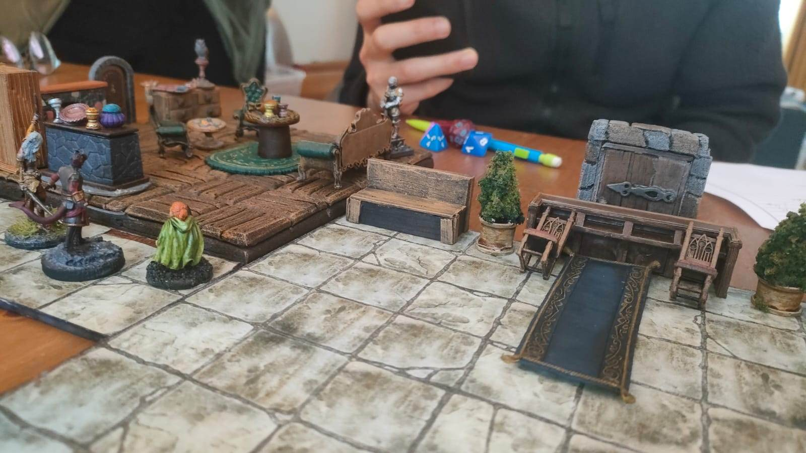

En fouillant, les objets commencent à léviter et projettent les joueurs au plafond et au sol. <i>Scalpel</i> parvient à amortir sa chute en utilisant un des cadavres comme matelas. <i>Cornes</i> détruit finalement la cage, dans un accès de rage, rétablissant l'ordre dans la pièce. Ils comprennent que cette salle est utilisée pour permettre aux familles de dire adieu aux patients avant qu'ils ne soient conduits dans une autre aile du bâtiment.

Terrifiés par le monstre aperçu dans la brume, ils décident de ne pas retourner dehors et ouvrent une autre porte. Ils découvrent une salle partiellement effondrée avec six cadavres portant des sacs en jute sur la tête, étranglés et asphyxiés. Caché dans un tonneau, ils trouvent le personnage de Traz, un gnome amnésique qui rejoint leur groupe. Le gnome leur explique que c'est une vieille dame, complétement nue, et avec le visage caché par un masque fait de morceaux d'os qui a tué et étranglé les cadavres.

### La Bibliothèque

Continuant leur exploration, ils ouvrent des doubles portes menant à une grande bibliothèque. S'étalant sur deux niveaux, la pièce est remplie de livres, dans une atmosphère feutrée. Les rayons du bas sont essentiellement remplis de  livres de conte pour enfants, et sont en pagaille. Les rayons du haut contiennent des ouvrages plus sérieux, sur différentes pathologies du cerveau et les différents moyens de les traiter. Pendant leur exploration, les joueurs entendent des petits bruits de pas et doivent régulièrement faire des Jets de Sauvegarde de Willpower, et parfois agissent de manière étrange en réaction.

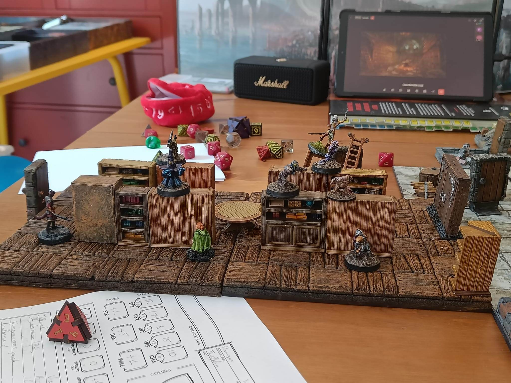

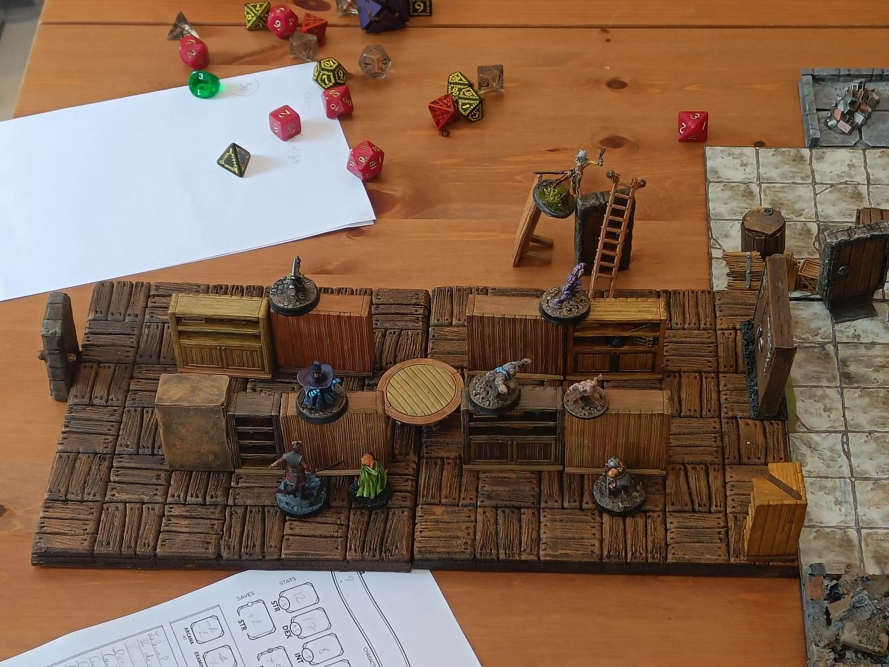

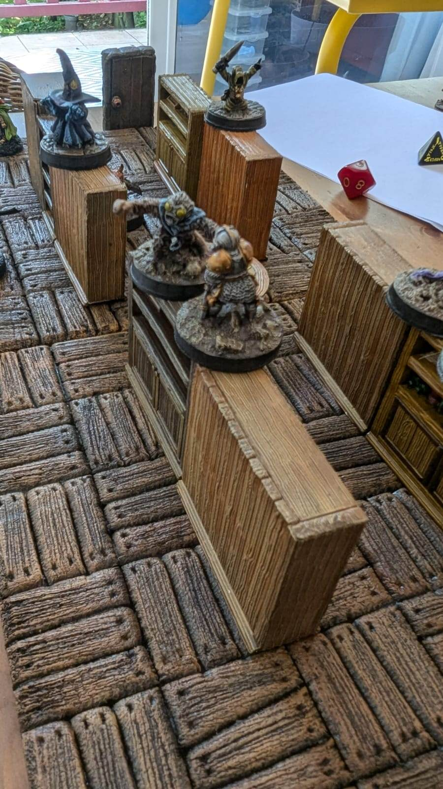

Ils finissent par découvrir six petites créatures. Ils comprennent que ces créatures sont les "méchants" des livres de conte, qui se sont échappés de leurs histoires et ont pris forme physique dans la bibliothèque. Une fois découverts, les créatures engagent le combat. Bien que peu résistants, ces monstres lancent des sorts perturbant l'état mental des personnages, les forçant à s'attaquer entre eux, ou à se rouler par terre de rire. Les joueurs s'en sortent sans trop de dégâts (si ce n'est à leur dignité) et continuent leur exploration de l'autre côté de la bibliothèque

Ils arrivent dans un couloir en L avec plusieurs portes menant à différents bureaux. Au fond du couloir, une double porte mène au bureau de la directrice Élise Losandro. Des traces gluantes relient trois pièces voisines. Les traces semblent un mélange de bave et de formol. Dans une grande salle remplie d'alambics et de blouses blanches baignant dans du formol, ils trouvent le cadavre d'un docteur dont la tête bouge légèrement. Décidant de le laisser tranquille, ils referment la porte et continuent leur exploration. Dans une petite salle d'administration, deux cadavres gisent avec l'arrière du crâne éclaté et vidé. Tout ceci n'inspire guère confiance aux héros, et ils decident d'éviter les autres pièces, se concentrant sur la double porte donnant sur le bureau du Docteur Losandro.

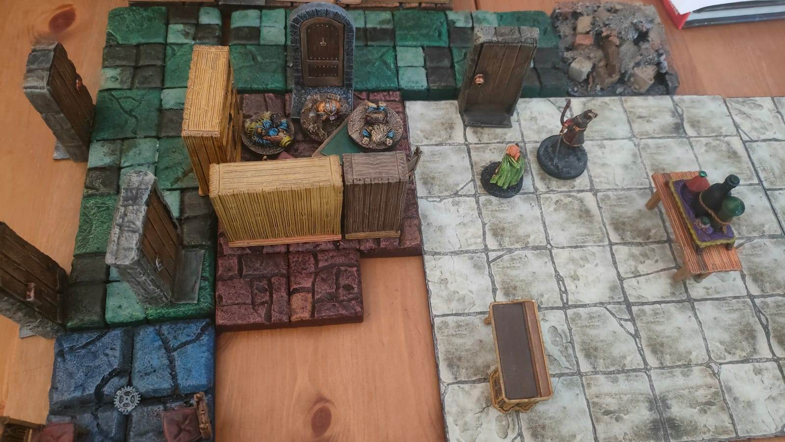

### Le bureau de Élise Losandro

La pièce est somptueusement décorée d'un mobilier très luxueux et de très bon gout. Malheureusement, tout ceci est gaché par l'immense flaque de sang au centre de la pièce. Au milieu se trouve ce qu'il reste de Élise Losandra, à genoux sur le sol, les bras le long du corps, la tête en arrière et avec une fumée multicolore qui s'échappe de sa bouche comme un arc-en-ciel agonisant se transformant en brume jaune. Nos héros décident de mettre fin à ses jours à distance, à base de Traits de Feu et autres Pierres-Tonnerres.

Malheureusement, en mourant, la directrice Losandro émet une vague d'énergie nécrotique qui plonge le gnome dans un court moment d'inconscience, et tue <i>Scalpel</i> sur le coup. (En vérité, Samir a du rentrer précipitamment sur Paris à ce moment de l'aventure; on a donc narré dans le jeu que son perso s'était sacrifié pour permettre de détruire Losandro et éviter trop de dégats sur le gnome). 

En fouillant la pièce, ils découvrent une dizaine de petits tableaux, peints au fusain sur du papier blanc, mais affichés dans des cadres richement décorés. Tout ces tableaux représentent une ville qui s'étend à l'infini, dans un paysage de désolation, nimbée de brouillard jaune. Les tableaux sont signés des lettres U.Z. et ont tous des été peint dans les 10 dernières années. 

Ils trouvent également un trousseau de clés et divers objets étranges sur le bureau (tels un presse papier en bois sculpté en forme de cervelle, des serre-livres représentant des visages en train de crier ou bien une pyramide en cuivre brut). En déverrouillant le tiroir privé de la directrice, ils mettent la main sur son cahier de notes ainsi que sur un petit trésor en terme d'objets magiques mineurs.

Dans le carnet, ils trouvent différentes notes qui expliquent que Zandalus était un patient muet, qui faisait des cauchemars. Le compte Wolfgang Von Friedrich semble intéressé par ce patient et a proposé un moyen de le soigner au Docteur Losandro, en utilisant un livre nommé <i>Les Chaines de la Nuit</i>. Le Docteur Losandro est initialement très sceptique, mais une fois qu'elle peut voir le livre, elle est convaincue. Von Friedrich accepte de lui prêter le livre, à condition qu'elle accepte 4 de ses hommes (nos PJs), amnésiques, dans son établissement, de manière officieuse.

