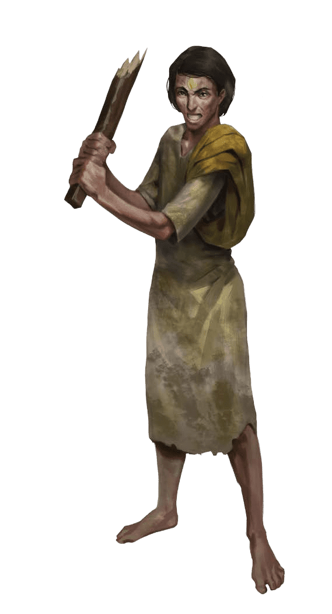
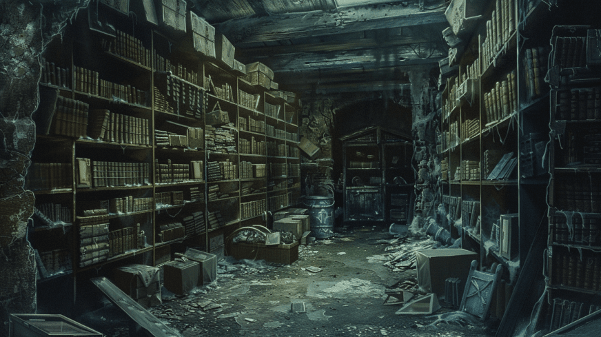
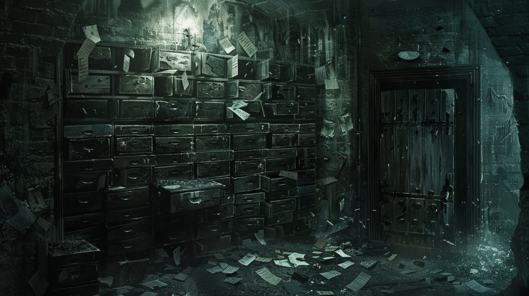
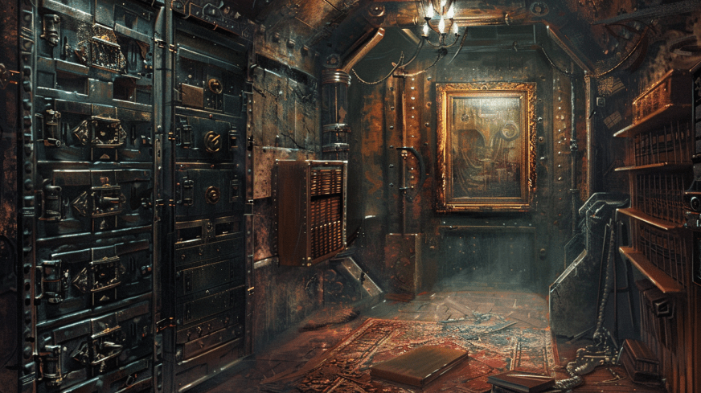
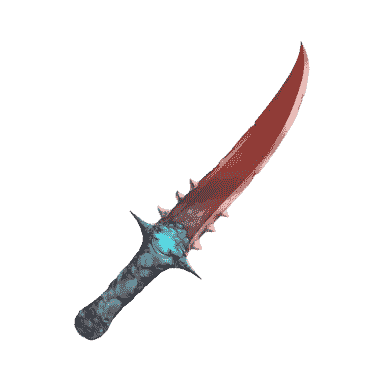
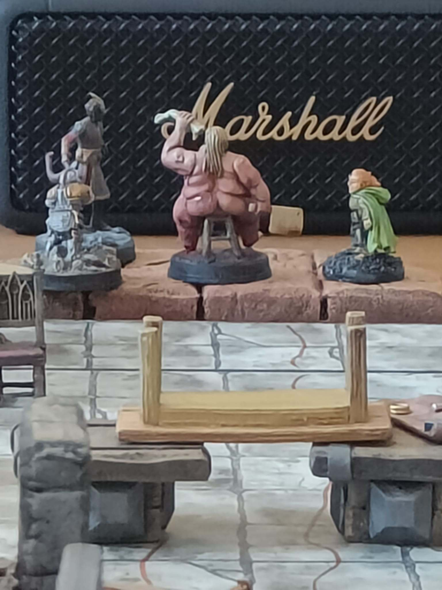
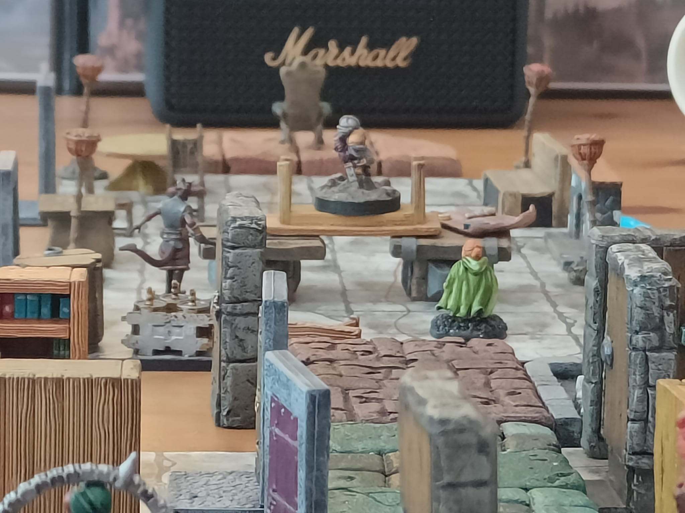
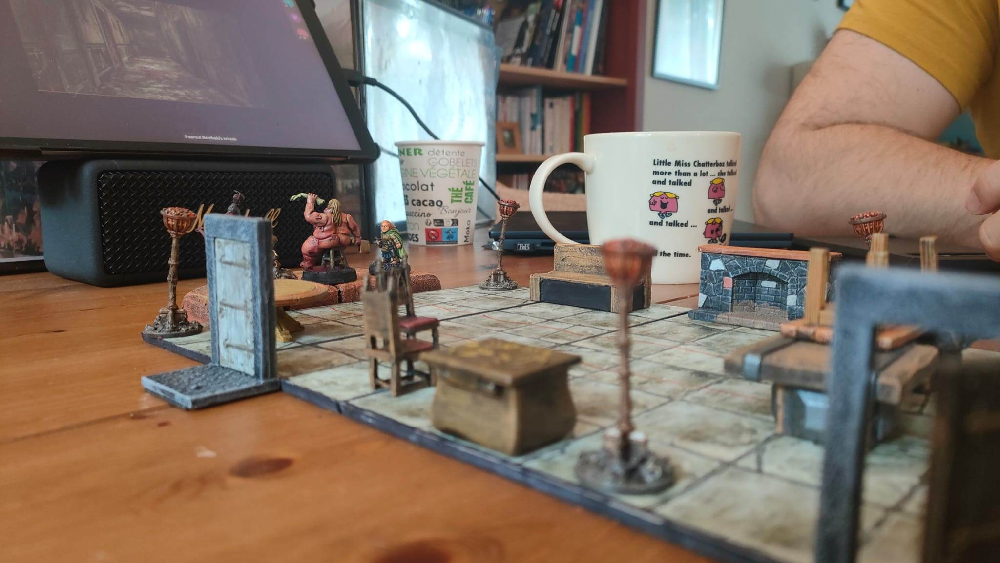
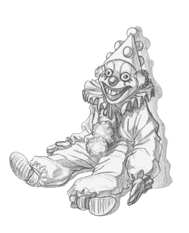
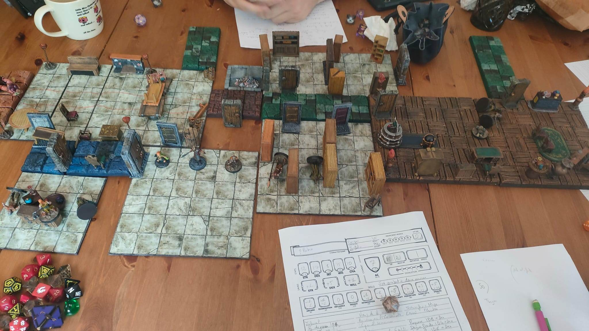

Où nos joueurs explorent les archives de l'asile et en apprennent plus sur
Zandalus et leur propre passé. Ils se font repousser par un torrent de sang,
qu'ils traversent avec un pont fait avec le mobilier. Ils combattent plusieurs
cultistes, ainsi qu'un petit garçon et ses couvertures animées dans une pièce
plongée dans le noir.

<i>Samir ayant du nous quitter en cours de route, le reste de l'aventure se fera avec uniquement 3 joueurs.</i>

    
    
À la fin de la session précédente, nos joueurs étaient dans le bureau de la directrice Losandro.

    
En fouillant la pièce, ils découvrent une dizaine de petits tableaux, peints au fusain sur du papier blanc, mais affichés dans des cadres richement décorés. Tout ces tableaux représentent une ville qui s'étend à l'infini, dans un paysage de désolation, nimbée de brouillard jaune. Les tableaux sont signés des lettres U.Z. et ont tous des été peint dans les 10 dernières années.

    

    

    

    

    

Ils trouvent également un trousseau de clés et divers objets étranges sur le bureau (tels un presse papier en bois sculpté en forme de cervelle, des serre-livres représentant des visages en train de crier ou bien une pyramide en cuivre brut). En déverrouillant le tiroir privé de la directrice, ils mettent la main sur son cahier de notes ainsi que sur un petit trésor en terme d'objets magiques mineurs.

    

    

    

    

    

    

    
    Dans le carnet, ils trouvent différentes notes qui expliquent que Zandalus était un patient muet, qui faisait des cauchemars. Le compte Wolfgang Von Friedrich semble intéressé par ce patient et a proposé un moyen de le soigner au Docteur Losandro, en utilisant un livre nommé <i>Les Chaines de la Nuit</i>. Le Docteur Losandro est initialement très sceptique, mais une fois qu'elle peut voir le livre, elle est convaincue. Von Friedrich accepte de lui prêter le livre, à condition qu'elle accepte 4 de ses hommes (nos PJs), amnésiques, dans son établissement, de manière officieuse.

    

    

    

    
    
En ouvrant la seconde porte qui s'ouvre de l'autre côté du bureau, ils entendent des bruits de fouilles provennant des pièces adjacentes. Trois apôtres en Orpiment, anciens patients vêtus des robes de l'asile et arborant un œil jaune peint sur le front, fouillent dans des caisses contenant les affaires des patients ainsi que dans une salle remplie de dossiers. 

    
Nos joueurs engagent le combat contre deux apotres dans une salle pleine des anciennes affaires des patients, pendant qu'un troisième de l'autre côté du couloir vient en renfort. Les PJs subissent de lourds dégats (surtout quand les Apôtres ont deux attaques chacun, et potentiellement avec avantage quand ils sont deux sur la même cible, et que les PJs n'ont qu'une seule esquive possible). Les PJs sortent victorieux, mais bien amochés.

    

    

    

    

    
    
Dans une autre salle, des dizaines de feuilles éparses forment soudainement un visage aux yeux fermés avec un œil dessiné sur le front et une grande queue de cheval; ce qu'ils savent être la description de Zandalus. 

    
Déguisés en apôtres en Orpiment, ils tentent de dialoguer avec la créature, bien que celle-ci ne soit pas très coopérative, et finalement les feuillent retombent sur le sol, inertes.

    
    
Les joueurs continuent leur exploration, dans salle contenant de grands tiroirs en métal, pour les patients les plus complexes. Chaque patient possède son propre tiroir métallique avec sa clé. 

    
Quatre tiroirs sont dédiés à Ulver Zandalus, décrivant un patient calme et muet qui peignait sans cesse les mêmes scènes urbaines jusqu'à devenir soudainement très agité.

    
    
Ils découvrent également une feuille cachée contenant quelques notes griffonnées par la directrice, pour tenir le compte des 4 patients amnésiques qu'elle a accepté. 

    
Nos joueurs apprennent alors leurs véritables noms: Taim pour Samir, Miranda pour Maud, Robin pour Tut et Jasp pour Trazou. Ils ont aussi la confirmation d'avoir précédemment travaillé pour Von Friedrich avant d'être mis à l'asile. 

    
Et ils mettent la main sur une dague scupltée dans une griffe de Basilic, avec un pouvoir de pétrification.

    
    
Poursuivant leur exploration, ils arrivent au bout du couloir étroit. La porte du fond pulse comme un cœur battant, une goutte de sang perlant. Jasp, avec sa dague, entaille  légèrement la porte et découvre encore plus de sang. 

    
Miranda, avec le trousseau de clés trouvé sur Losandro parvient à ouvrir la porte et un torrent d'hémoglobine projette le groupe en arrière.

    
Miranda se cache dans une pièce adjacente tandis que les autres sont projetés jusqu'au bout du couloir, emportés par le torrent.

    

Se relevant péniblement, couverts de sang, ils avancent dans le couloir inondé jusqu'à mi-cuisse pour certains, à la taille pour d'autres, luttant contre un faible courant. Le sang avance par vagues régulières vers une immense pièce. Miranda sent des mains tenter de l'entraîner vers un fond anormalement profond. Grâce à sa force, elle s'extirpe et tous arrivent dans une grande salle ressemblant à un réfectoire. Une porte est bloquée par le torrent de sang; des petites tables avec des jeux de société éparpillés jonchent la pièce.

    

    

    
    
À l'autre extrémité, un grand fauteuil leur tourne le dos, une silhouette avachie dessus. Ils s'approchent prudemment, enjambant le torrent de sang en construisant un pont avec le mobilier de la pièce. 

    
La silhouette blessée au cœur saigne continuellement; ils tentent de cautériser la blessure (avec un Trait de Feu) sans succès, provoquant une explosion d'hémoglobine. 

    
Ils décident d'ignorer la femme, nommé Mme Tomanelle à en croire le nom sur sa gourmette, et explorent le reste de la salle.

    

    

    

    

    

    

    

    

    

Jasp est hypnotisé par le paysage se trouvant derrière les fenêtres. Des volutes de fumée jaunâtres éclairées par une lueur d'outre-tombe forment des ombres ondulantes sur le sol. Après une claque de Miranda, il se réveille et ils évitent de regarder dehors. Ils ignorent un grand couloir descendant au sud et se dirigent vers deux portes au nord. L'une est ouverte sur des ténèbres surnaturelles; l'autre est un passe-plat menant à une infirmerie remplie de bocaux et fioles médicinales.

    
    
Passant par le passe-plat, ils entendent des bruits de créatures droguées parmi les médicaments. En marchant sur du verre brisé, ils réveillent ces créatures qui lancent des pots générant divers effets. 

    
Une zone devient glissante comme de la pâte à tarte; un nuage de poussière obscurcit la vue, etc. Le combat se termine sur le plan de travail central.

    

    

        
        
    

    

    

Après avoir vaincu les apôtres drogués, le mélange de produits et de flammes créé une réaction chimique qui les force à fuir tous ensemble par le passe plat, Robin attrapant un gnome et le jetant devant lui avant lui-même de se jeter dans l'ouverture alors que la salle explose derrière lui.

Continuant leur exploration, ils trouvent une petite salle de pause figée dans le temps avec un set de thé froid sur une table. Jasp veut se reposer mais les autres l'entraînent vers une porte donnant sur une pièce plongée dans des ténèbres surnaturelles.

    
    
Avec des lanternes à leur ceinture, ils entrent prudemment dans ce qui semble être une salle de garde dont le mobilier est propulsé contre les murs extérieurs. 

    
Au centre, un nid fait de bois et vêtements abrite une voix enfantine appelant "Braem ?". La voix change entre enfantine et adulte demandant "Veux-tu jouer avec moi ?". 

    
Robin accepte et la créature lui montre des petits soldats de bois, étrangement sculptés pour ressembler à Robin et Jasp, et fait se frapper les jouets ensemble. Robin se sent alors pris d'une compulsion le forçant à frapper réellement Jasp, ce qui initie un nouveau combat.

    
    
Frappant dans l'obscurité, nos héros frappent difficilement la créature. Elle a les traits d'un enfant innocent et cherche à faire culpabiliser les joueurs de la frapper. Elle semble néanmoins capable d'animer les couvertures et draps qui sont entassés dans la pièce et cherchent à étrangler les joueurs avec. 

    
Miranda se fait capturer et commence à suffoquer, jusqu'à ce que le reste du groupe parvienne à retourner la situation. Finalement triomphants, ils détruisent la créature qui crie ses derniers mots : "Je voulais juste jouer avec vous."

    

    

    

    

    

    

    

    

    

    

    

    

    

    

La lumière revient révélant une double porte barricadée menant à une immense salle. Des trous dans le plafond laissent entrer la pluie et le brouillard, qui monte sur plus d'1.5m de haut. Ils distinguent une trentaine de personnes en robes jaunes, murmurant "Zandalus voit !". Nos joueurs décident qu'il est temps de faire demi-tour et retourner à la chapelle pour partager ce qu'ils ont appris avec Sœur Daphné.

## Gallerie
