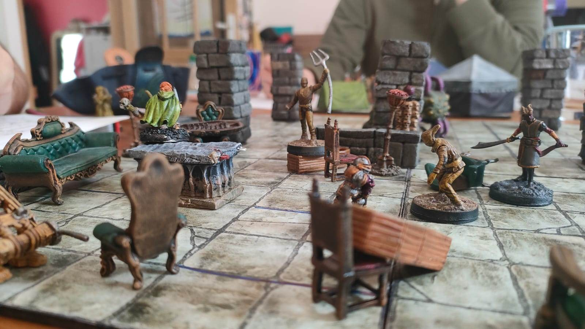
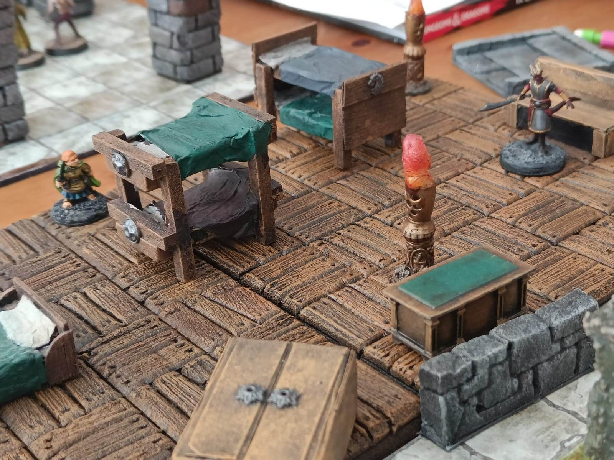

Où nos héros enchainent les combats sans pouvoir se reposer jusqu'à abattre
Zandalus et l'Homme-En-Lambeaux. Ils combattront Madame Aggra, ses gardes
épouvantails, un monstre tentaculaire sorti de leurs pires cauchemars, et iront
même se battre directement dans le royaume des rêves.

---

Madame Aggra arrive avec ses gardes, nue avec un masque en os et un hachoir
ensanglanté. Elle examine les documents fourni par Jaspe, et (après avoir
demandé confirmation à un de ses acolytes car elle ne sait pas lire), les fait
brûler dans un brasero. Elle remercie les joueurs et les escorte jusqu'à son
repaire à côté de la chambre de Zandalus.

Les personnages cherchent le docteur Elborn des yeux mais se rendent compte que
le camp des apôtres est en effervescence. Depuis que les PJs ont ouvert la porte
Sud, les apôtres ont commencé à sortir dans le reste du bâtiment, à la recherche
de nouvelles pièces à piller. 

    
    
Inquiets pour Sœur Daphné, ils montent au premier étage où ils découvrent une salle remplie de fauteils et de canapés éventrés. Sur les murs, d'autres cadavres sont crucifiés, la tête recouverte d'un sac en toile de jute. 

    
Parmi les tapis et coussins, ils voient aussi des cerceuils et autres vierges de fer.

    
Même si la décoration de la pièce est étrange et le mobilier brisé, il n'en reste pas moins bien plus confortable que ce que les survivants au rez-de-chaussé ont.

    

    

    
    
Dans une pièce adjacente, trois apôtres en orpiment, à genoux sur le sol, les bras le long du corps et la tête en arrière émettent un épais brouillard jaune qui sort de leur bouche. Ils sont placés en cercle, dos à dos. 

    
Le mur Nord de la pièce est entièrement brisé et semble donner sur une ville grise, s'étendant à perte de vue. Des colonnes soutiennent le plafond, et la pièce donne la sensation d'être déjà à moitié dans une autre dimension.

    
    
Pendant que Madame Aggra cherche dans une malle la "récompense" des PJs, Robin lance la bombe fournie par le docteur Elborn sur les trois apotres de la salle d'à côté, pile au moment où Madame Aggra sort 3 sacs en toile de jute pour les PJs. 

    
La bombe explose, tuant les trois apotres, mais transformant leur corps en un amalgame de chair et de tentacules étranges semblant venir d'un autre monde.

    

    

    
    
Madame Aggra attaque avec son hachoir, alors que les cadavres accrochés aux murs s'animent et s'en prennent aux PJs. 

    
Ils arrachent le sac qui est sur leur tête, révélant qu'ils ne sont fait que d'un mélange de brouillard et de rembourrage de canapé et la vision d'horreur qu'ils infligent aux personnages forcent ceux-ci à reculer ou rester sur place.

    
    
Le combat continue sur un autel en pierre, entre Miranda et Madame Aggra (dont le hachoir semble briller d'énergie nécrotique). 

    
Jaspe est coincé sur le dessus d'un canapé, le dos au mur, et envoie plusieurs décharges d'énergie électrique dans les montres. 

    
Le décor explose autour d'eux, et Madame Aggra finit par succomber, tombant dans un engin de torture qu'elle avait laissé derrière elle.

    

    

        
        
        
    

    

    

    

        
        
        
    

    

    
  

    

    

    
    
Les joueurs concentrent alors leurs efforts sur la créature d'outre-monde qui s'approche d'eux. 

    
Elle avance en rampant sur les murs et le plafond, et tente d'attraper tous ce qui se trouve à portée avec ses tentacules; mobilier, épouvantails, PJs, tout y passe. 

    

    

        
        
    

    

        
        
    

    

        
        
    

    

        
        
    

    <!-- 

 -->

    
    
Les joueurs parviennent finalement à en venir à bout, mais ils n'ont pas le temps de se reposer, car l'un des épouvantails à pu aller chercher de l'aide au premier étage, et c'est Zandalus lui même qui descends. 

    

    

    

    

    

    
    
Quand il s'approche des PJs, ceux-ci se sentent happés dans leurs propres cauchemars. Les murs de la pièce disparaissent, et les PJs se retrouvent dans un immense ciel étoilé, au milieu de l'espace insondable. Miranda et Robin s'évanouissent sur le sol.

    
    
Ils se réveillent dans une pièce aux exactes mêmes dimensions que celle où ils étaient, mais au mobilier complètement différents. 

    
Des lits sont en vrac dans la pièce à la place des canapés, des bureaux de médecin remplaces les chaises, et l'Homme-En-Lambeaux, la figure de leurs cauchemars, remplace Zandalus.

    

    

        
        
    

    

        
        
        
    

    

    

        
        
    

    

        
        
    

    
    
Dans le monde réel, Jaspe lance une nuée de projectiles magiques contre Zandalus, crevant sa peau comme un ballon de baudruche et laissant s'échapper à la place des volutes de fumées qui prennent forme humaine. 

    
    
Dans le monde des rêves, Miranda voit les formes spectrales de personnes qu'ils ont rencontrés apparaître à l'emplacement occupé par les volutes de fumées dans le monde réel.

    
    
Jaspe réveille Robin pour qu'il l'aide au combat contre Zandalus, et celui-ci allume une chandelle magique qu'ils avaient trouvés dans le bureau de Losandro. 

    
La chandelle permet de créer un champ de force qui empeche les créatures éthérées de le traverser. Cela a pour effet de bloquer l'arrivée des spectres de brume autour de Jaspe et Robin, mais n'empeche pas Zandalus d'approcher.

    

    

    

    

Dans le monde des rêves, Miranda se fait attaquer par de plus en plus de créatures, car à chaque fois que Zandalus est blessé, cela fait apparaitre une créature dans le monde des rêves.

    

    

    
    
Le monde autour d'elle semble aussi se modifier, transformant le décor d'asile avec ses lits et ses chaises et une foret sombre où les arbres semblent se rapprocher d'elle. 

    
Finalement, Jaspe parvient à infliger un dégat à Miranda, ce qui la force à se relever.

    

    
   

    
   

    

    

    

Ensemble, ils infligent suffisamment de dégâts à Zandalus pour le vaincre définitivement. Une déflagration supprime tous les fantômes éthérés et aspire l'Homme-En-Lambeaux à la place qui était occupée par Zandalus. Celui-ci semble désorienté dans ce monde étranger et nos héros profitent de ce moment pour concentrer leurs attaques sur lui et le réduire en charpie.

    

    

    

Et c'est ainsi que nos personnages victorieux terminent cette aventure épique \o/.

---

Dans l'épilogue de l'histoire, nos héros réussissent à s'échapper de l'asile. Avec la destruction de Zandalus et de l'Homme-En-Lambeaux, la brume disparaît de l'enceinte de Rochépine. Les habitants peuvent progressivement reprendre le contrôle de leur vie. Bien que la majorité reste ébranlée par les événements et que leur santé mentale était déjà fragile avant ces aventures, les derniers apôtres se rangent du côté des survivants. Quelques fanatiques, n'ayant plus Zandalus pour les protéger, finissent par céder à leurs pulsions et se transforment en goule et changeformes, qui sont rapidement mis en fuite ou tués.

Les immenses pattes d'araignées, semblables à des troncs vues auparavant, ne sont en réalité que des arbustes taillés dans la cour extérieure. Les contours de l'asile semblent reprendre leur apparence normale. Le batiment est tellement abimé qu'il ne peut plus servir en l'état, mais le pire est évité. De faibles tremblements de terre continuent d'agiter le sol, néanmoins.

Le capitaine Vaustin, Sœur Daphné, Lucellin, Joslyne et les autres guident les survivants vers les docks de l'ile, et allument un grand feu pour envoyer un signal de détresse à Roncebourg, de l'autre côté du lac. 

Tout le monde attends au bord de l'embarcadère. Les plus mal en point sont enveloppés dans des couvertures pour se réchauffer, pendant que les plus vaillants gardent un œil sur les ruines de l'asile, vérifiant que ses horreurs restent à l'intérieur.

    
    
C'est ici que s'achève le premier volet de notre histoire. 

    
La totalité du groupe a aimé l'expérience et nous avons tous passé un très bon moment. 

    
Au final on a du jouer ~35h en une semaine, mais aucun de nous n'a vu le temps passer. 

    
On est tous chauds pour faire le deuxième volet dans un an ou deux, sur le même principe.

