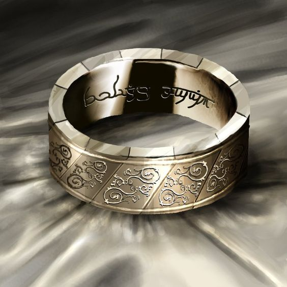

Nos trois aventuriers traversent la caverne pour aller descendre au premier
niveau de Stonehell. Ils explorent avec discrétion jusqu'à ce qu'un Kobold
parvienne à s'enfuir et à donner l'alarme.

Peu intéressés par les différentes ruines qui jalonnent leur chemin, nos
aventuriers décident d'aller directement vers l'entrée principale. L'avancée est
gaie, un lapin les regarde.

Finalement, leurs yeux débusquent deux entrées taillées dans la roche de chaque
coté de la caverne et ils décident d'y jeter un œil. Un sentiment de malaise les
prends quand ils sentent l'air froid venir de l'entrée sur la gauche et ils
décident de ne pas l'explorer. L'entrée sur la droite donne sur une petite pièce
carrée à l'odeur de moisi, mais voyant que celle-ci donne sur deux couloirs et
une porte fermée, ils décident de l'ignorer aussi.

L'un des batiments en ruine, qui comporte encore certaines de ses arches en
pierre et une statue d'un nain en armure, genou à terre, attire leur attention.
Ils identifient que la statue représente un ancien dieu du devoir et de la
fidélité. Après une courte prière, ils continuent en direction de l'entrée de
plus belle, en faisant un petit détour par la cascade. Ils y découvrent une
végétation luxuriante, en grande partie due à la chaleur de l'eau.

L'unique œil valide d'Arenden parvient à débusquer une entrée camouflée derrière
des buissons, sur la droite de l'arche principale. Ils se décident donc
à l'explorer en priorité. Ils n'y découvent que quelques pièces abandonnées, ne
comportant rien de plus que des outils d'aventurier oubliés, humides ou cassés.
Ils mettent fin aux souffrance d'un blaireau blessé, tuent quelques puces de
lit géantes et coupent un cobra géant en rondelle sans difficulté. Ce sera un
piège à base de sac de sable qui leur donnera leur première vraie action
(heureusement, le casque d'Arenden arreta toute potentielle blessure).

Dans la dernière salle, trop pressé de vouloir lire les inscriptions sur le
trone en pierre, notre sorcier ne vit pas la dalle piègée et tomba dans un
profond trou. Il s'en sorti indemne, et cela ne l'empecha pas de découvrir une
porte secrète qu'ils parvinrent à débloquer avec leur force combinée. La salle
suivante semblait être un repaire d'alchimiste, mais toutes les potions étaient
soient renversées soient brisées. Néanmoins, ils réussirent à trouver dans un
pied de la table quelques pièces d'or, une potion de soin et un anneau magique.
À part quelques runes Elfes et le fait qu'il ait un rapport avec la
téléportation, ils ne purent en comprendre mieux les effets.

Déçus de ne pas avoir découvert une entrée secrète au donjon, nos aventuriers
font marche arrière et se résignent à entrer dans Stonehell par la porte
principale. Des inscriptions anciennes gravées au dessus de la porte attirent
leur attention pendant un instant, mais ne parvenant pas à les déchiffrer, ils
abandonnent bien vite et rentrent dans le couloir principal, puis le long des
centaines de marches en colimaçon pour finalement enfin atteindre le premier
niveau de Stonehell.

Le premier reflexe est de cartographier le lieu en jetant un œil dans toutes les
directions. Ils choisissent ensuite de s'aventurer dans le couloir qui ne
nécessite pas d'ouvrir une porte ou de se faufiler dans la gueule de créatures
sculptée. Ils entrent alors dans une salle au sol chargé de restes de squelettes
Orques et Nains, au sang séché sur le sol. Rapidement un courant d'air se fait
sentir, suivi d'une voix les exhortant à fuir s'ils ne veulent pas voir leurs os
rejoindre ceux déjà présents. Ils se décident à suivre l'origine du vent,
soulevant une herse qui leur bloque le passage et découvrent une étrange
sculpture dans une pièce en cul-de-sac.

Ce qu'ils nommeront rapidement "la statue Pizza" est un cercle divisé en 20
quartiers. Ils ne parviennent pas à déchiffrer le contenu exact des runes
indiquées sur les quarties mais comprennent que la roue peut etre tournée. Aucun
d'eux n'a le courage (ou la folie) de tenter néanmoins.

En voulant fouiller sous les écailles en pierre d'une statue de poisson, ils
déclenchent un piège répandant un gaz verdatre les obligeant à avancer plus
rapidement qu'ils ne l'avaient prévus. Bloqués par une porte en bois noir
renforcé qu'ils ne parviennent pas à ouvrir, ils prennent une autre direction et
continuent leur exploration dans des cavernes naturelles creusées à même la
roche. Des champignons lumineux leur permettant même de facilement se repérer.
Ils passent à coté d'un puit qui siffle, mais repèrent rapidement un groupe de
Kobold en train de récupérer du guano de chauve-souris dans une caverne
adjacente.

S'approchain discrètement, ils parviennent à les attaquer par surprise et avec
l'action conjointe de leur sort de feu et des attaques des deux guerriers, la
moitié des Kobolds sont morts avant d'avoir pu comprendre ce qui leur arrivait.
Les derniers kobolds tombent sous leurs coups, mais l'un parvient à s'enfuir. Le
sorcier laisse échapper sa lance qui tombe dans le guano et en portera l'odeur
pour plusieurs jours. Peu de temps avant qu'ils ne puissent reprendre leurs
esprit, Torok repère une forme reptilienne au plafond qui s'avance vers le
groupe. Il tente d'envoyer sa hache de lancer magique pour atteindre la créature
mais la rate et plante sa hache dans le plafond.

La créature, une sorte de lézard géant, se laisse tomber du plafond et attaque
le sorcier. Sous les coups combinées de nos trois aventuriers, le lézard ne fait
pas long feu.

Ne perdant pas de temps, nos aventuriers partent à la poursuite du Kobold
fuyard. Ils parviennent à retrouver se trace, mais celui-ci a rejoint son clan,
armé d'arbalètes et cachés derrière des barricades, qui tirent sur Torok.
Heureusement, celui-ci a obtenu les faveurs de son dieu qui lui a octroyé une
protection telle que ni les carreaux, ni les dards du piège qu'il
a malencontreusement activé, ne lui font de l'effet. Il parvient même
à escalader la barricade et à engager les Kobolds au corps à corps. Le kobold
fuyard inital a par contre encore réussi à s'enfuir.

Pendant ce temps, Arenden est pris de malchance et pendant qu'il essaie de
pourfendre quelques gros rats qui s'en prennent à des cadavres qu'il a découvert
dans une petite pièce, l'un d'eux parvient à se faufiler dans son pantalon par
la jambe et lui déchire en lambeaux celle-ci. Si ce n'était grâce au Sorcier qui
parvient à la trainer hors de la pièce et lui administrer la potion de soin
trouvées précédemment, ça en aurait été fini d'Arenden.

Quelques soins plus tard, tout le monde est de nouveau en forme et les Kobolds
morts ou en fuite. Nos aventuriers décident de monter un camp de repos dans la
pièce de la statue à pizza. En passant à nouveau près des os, ils entendent
à nouveau exactement la même voix que précédemment et en déduisent que c'est une
voix pré-enregistrée qui se répète. Cela fait de leur lieu de camp un lieu
parfait. Le nuage toxique qu'ils ont laissé échapper de la fontaine bloque un
accès, alors que quiconque tentera de passer par l'autre activera la voix.

Ils décident de passer la nuit là pour continuer leur exploration le lendemain.

## Point règles

### Défoncer une porte

Pour défoncer une porte (ou tout autre object), il faut le frapper avec une arme
capable de le détruire (hache, marteau, etc). On touche sur une Parry de 2. Il
faut ensuite dépasser le Toughness de la porte (6 pour porte simple, 8 pour
épaisse, 10 pour renforcée).

### Poison

Quand un personnage est infecté par du poison, il doit réussir un jet de Vigor
ou prendre un niveau de Fatigue (-1 à tous les jets, maximum -2. Si -3,
évanoui)

### Découvrir un piège

Lors de la fouille d'une salle, si réussite avec un Raise, découvre
potentiellement les pièges et portes secretes. Si marche sur un piège sans le
savoir, peut avoir un jet d'Athlétisme ou de Notice pour limiter les effets.

### Fouiller une pièce

Jet de Notice. Seulement une personne peut fouiller une pièce, et ne peut le
faire qu'une fois. Selon la marge de réussite, le MJ indique ce que le PJ
trouve. Si la salle ne contient rien, même une très forte réussite ne fait pas
apparaitre un loot.

### Identifier des objets

Jet de Spellcasting. Réussite indique si Magique ou non. Raises ajoutent des
infos sur le type d'enchantement.

### Possibilité d'exploser sur les dégats

On s'est demandé si les dès explosent pour les dégats. Oui, mais on ne peut pas
utiliser de Benny pour les relancer.

### Pass si égal au TN?

On s'est demandé si un jet égal au TN comptait comme une réussit ou un échec, et
c'est comme une réussite.

### Charge

Sur cette partie on a donné un bonus de +2 pour toucher si on se déplace avant
(charge). C'était une erreur, il n'y a pas de tel bonus (à la rigueur en prenant
un Edge pour ça).

### Holy Warrior

Coute 1PP et affecte toute créature dans un rayon égal au Spirit. Victimes
doivent faire un test de Spirit, si raté elles sont Shaken. Sur un 1, elles sont
mortes.

Normalement, ne s'applique qu'aux mort-vivants et aux démons. Dans le contexte
d'un donjon, j'accepte que cela s'applique à toutes race considérée comme
mauvaise. Les animaux ou créatures sans réel inclinaison mauvaise sont
immunisées. Une créature ne peut pas être victime d'un Holy Warrior plus d'une
fois.

### Potion de soins

Les potions de soin enlèvent automatiquement un Shaken et une Blessure. La cible
a aussi le droit à un jet de Spirit et chaque réussite et Raise supprime une
Blessure supplémentaire.

## Ennemis

Les ennemis suivent des archétypes d4 pour la piétaille (kobolds, rats, etc), d6
pour les adversaires classiques (gobelins, hommes de main) et d8 pour les
adversaires plus coriaces.

### D4
Fighting, Shooting avec un d4. Parry et Toughness de 4. Dégats avec 2d4.

### D6
Fighting, Shooting avec d6. Parry et Toughness de 5. Dégats avec 2d6.

### D8
Fighting, Shooting avec d8, Parry et Toughness de 6. Dégats avec d8 + d6.

### Blaireau malade

Archétype d4, mais si parvient à passer la Toughness, la cible doit faire un jet
de Vigor ou subit un niveau de Fatigue.

### Kobolds

Archétype d4. Attaquent en nombre et possèdent donc un bonus de +1 de Ganging
Up. Fuient le combat s'il tourne mal.

### Drakon

Archétype d6, mais en Wild Card, donc plus long à tuer. Il peut s'accrocher aux
murs et donc tomber du plafond pour attaquer. Si par surprise, possède The Drop
(+4 Attaque and Damage)

### Rats

Archétype d4. Attaquent en nombre, mais pas plus de 1 par case adjacente à la
cible. Quand attaqué, chaque raise sur les dégats tue un rat supplémentaire.
